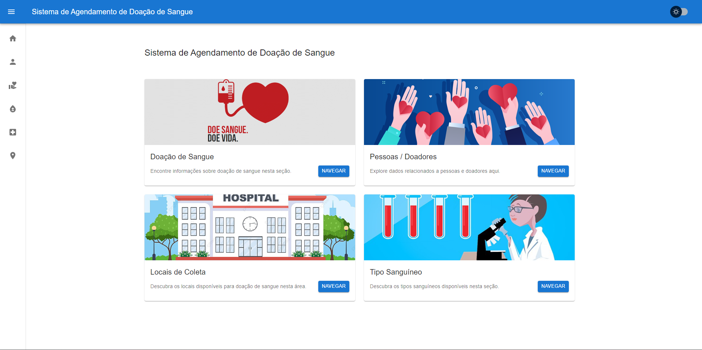
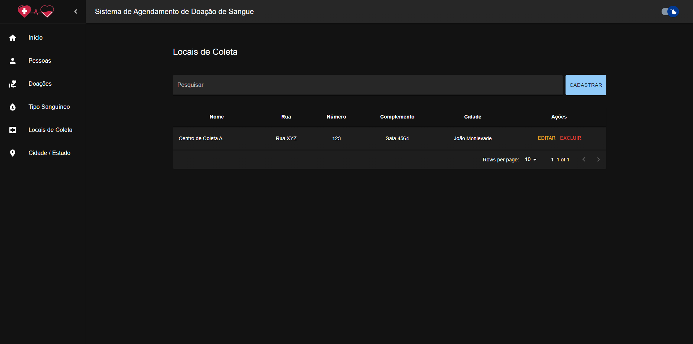

# Sistema de Agendamento de Doação de Sangue

Este projeto foi desenvolvido como parte do curso de Sistemas de Informação na Universidade Federal de Ouro Preto, especificamente na disciplina Sistemas Web I (CSI606). O objetivo principal deste trabalho é aplicar os conceitos apresentados ao longo do curso e colocá-los em prática.

## Tecnologias e Bibliotecas

### Backend

- Banco de Dados Relacional PostgreSQL
- Node.js
- Fastify
- TypeScript

### Frontend

- Axios
- React
- Material UI
- TypeScript

## Telas e Funcionalidades

### Tela Inicial

#### Na tela inicial, encontram-se as principais funcionalidades e atalhos para navegação.

### Funcionalidades

#### No menu localizado no canto esquerdo, você encontrará todas as funcionalidades disponíveis. A opção para ativar o modo noturno está localizada no canto superior direito.

